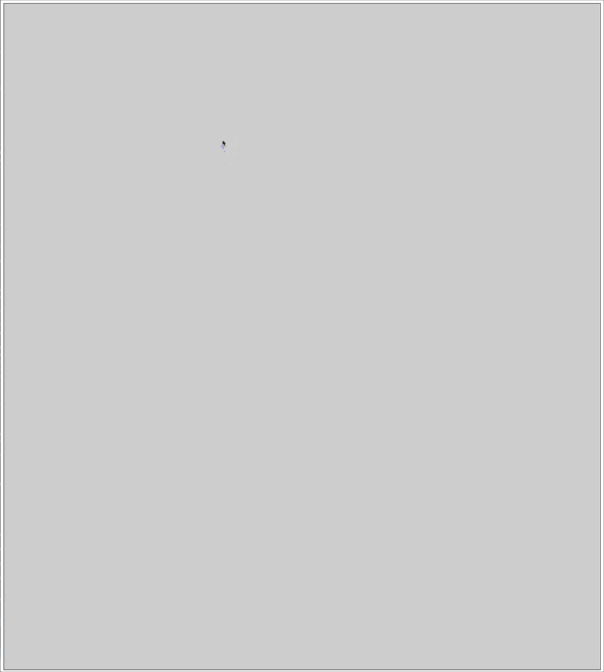

# Assignment 0:  Typescript, Web, Simple Graphics warmup 

This is a skeleton, based on ex1, of a small web drawing program in TypeScript.  This is the starting point for a0. 

## Due: Wednesday Aug 28th, 11:59pm

## Overview 

The goal of this assignment is to allow you to self-assess whether you are prepared to take this class.  As such, even if you do not plan to do the assignment until after the drop deadline, you should look at it and think about it, to make sure you are comfortable with what I am asking you to do.

There are a variety of sub-goals to this project, all related to the major goal. You will get some initial experience with Typescript, create a simple data structure common in graphics (a circular buffer), gain experience with the common structure of interactive graphical program (not just on the web), implement a solution to a small geometric problem, and (not least of which) ensure your development and debugging environments are set up before the first larger assignment.

Your assignment is to complete the implementation of app.ts and pointset.ts so that the program behaves as demonstrated in class and described here and in the code comments.  The result should look like this:



In particular:

1. app.ts contains a lot of the code for this example, you should complete it.
2. pointset.ts is mostly empty, you need to implement the main PointSet class that is used by the application in app.ts
3. PointSet should be implemented as a circular buffer, as described in the comments in the file.  The key feature of a circular buffer is that the contents of the buffer are never moved or copied as new elements are added or removed.  Instead, the index markers for the start and end are updated.  The interface methods of the class hide the implementation details from the programmer: they can simply request the first, second, third, etc. element as desired.
4. the program should create one "point" per animationFrame and store 30 points (1 second worth of data at 30 frames per second).  The points should be rendered such that they appear to fade out as the mouse moves.  New points should not be created when the mouse is outside of the canvas, but old ones should continue to disappear.
5. when the user clicks and drags, a grey hollow rectangle should be traced out from the start point to the current mouse location.  If the user releases the button, a rectangle with a thick black border containing a quadrilateral of a random color should be created (see more details on what should be drawn, below).  If the user moves the mouse out of the canvas, the rectangle creation should be canceled.
6. the canvas should be redrawn each animation frame, with each of the created rectangles being rendered.  Nothing should be drawn in the canvas outside of the render function.
7. The quadrilateral inside the rectangle should be drawn as follows:
    - its four corners should be the mid-points on each edge of the rectangle
    - it should have a black border, and be filled with a color that was randomly chosen when it was created
    - if the area of the quadrilateral is > 250 pixels, another quadrilateral should be drawn inside it, recursively 
        - for each step of the recursive drawing, the corners of the quad should be the mid-points on it's parent's edges.

Your grade will be based on satisfying each of these requirements.

# Submission

You will check out the project from github classroom, and submit it there.  The project folder should contain just the additions to the sample project that are needed to implement the project.  Do not add extra files, and do not remove the .gitignore file (we do not want the "node_modules" directory in your repository.)

**Do Not Change the names** of the existing files (e.g., index.html, app.ts, etc).  The TAs need to be able to test your program as follows:

1. cd into the directory and run ```npm install```
2. compile with ```tsc```
3. start a local web server in your directory (see below) and visit ```index.html```

Please test that your submission meets these requirements.  For example, after you check in your final version of the assignment to github, check it out again to a new directory and make sure everything builds and runs correctly.
 
# Development Environment

The sample has already been set up with a complete project for Typescript development.

To work with this sample and prepare your submission, you should have Node (and in particular, npm) installed, which you can retrieve from [nodejs.org](http://nodejs.org).   

In addition to node, you should make sure a recent (e.g., version 3.5 or later) version of Typescript is installed, as described at [www.typescriptlang.org](http://www.typescriptlang.org).

Finally, we will use [https-localhost](https://www.npmjs.com/package/https-localhost) to run a local https webserver on your machine.  The ```package.json``` is set up to run this server on Mac and Linux (see below), but on Windows you will need to install the server globally, as described on the package website: 
```
npm i -g --only=prod https-localhost
```

If you are in your project directory, you can start the server with ```serve```

## Running 

You can compile the typescript to javascript:
```
tsc
```
You can also run ```tsc --watch``` so that ```tsc``` remains running and recompiles whenever you save a file. 

The project also includes a simple https-localhost package (specified in the ```package.json```) and a command to launch a web server to serve up the files in this directory.  To use it, you must install all the required npm packages, and then run ```serve``` command in the ```package.json``` using ``npm run```
```
npm install
npm run server
```

Alternatively, if you install ```https-localhost``` globally (needed on Windows), you can just run ```serve``` in the project directory.

You can run the sample by pointing your web browser at ```https://localhost:8080/index.html```